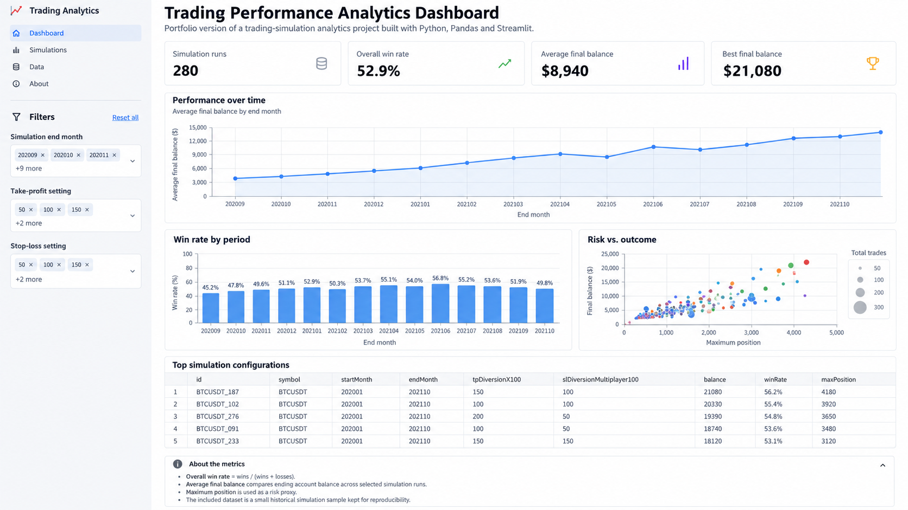

# Trading Performance Analytics Dashboard

An interactive Data Analytics project for exploring trading-simulation results, comparing strategy configurations, and evaluating performance and risk indicators.

## Dashboard preview



*Overview of the portfolio dashboard showing KPI cards, performance trends, win-rate analysis, risk vs. outcome, and top simulation configurations.*

## Project story

I originally built this project as a tool for monitoring and reviewing trading-simulation outputs. I later redesigned it as a self-contained analytics dashboard focused on the analytical side of the work: preparing data, defining KPIs, comparing strategy parameters, and communicating results through interactive visualizations.

The portfolio version is intentionally reproducible and does not require access to a private database, server, or trading account.

## What this project demonstrates

- Data preparation and KPI calculation with **Python** and **Pandas**
- Interactive filtering and dashboard design with **Streamlit**
- Exploratory visual analysis with **Plotly**
- Comparison of simulation parameters, risk exposure, and final outcomes
- Translating raw simulation output into metrics that support decision-making
- Designing a reproducible portfolio project without exposing private infrastructure or credentials

## Business questions

The dashboard is designed to answer questions such as:

1. Which simulation configurations produced the strongest ending balances?
2. How does win rate change across tested periods?
3. Is higher position exposure associated with better or worse outcomes?
4. Which take-profit and stop-loss settings are associated with stronger results?
5. Which configurations appear attractive when performance and exposure are considered together?

## Key metrics

- **Simulation Runs** - number of runs included after filtering
- **Overall Win Rate** - wins / (wins + losses)
- **Average Final Balance** - average ending balance across selected runs
- **Best Final Balance** - highest ending balance in the selected sample
- **Maximum Position** - used as a simple risk/exposure indicator

## Dashboard views

- KPI summary cards
- Average balance over time
- Win rate by simulation period
- Risk vs. outcome scatter analysis
- Ranked table of top simulation configurations

## Analytical workflow

1. Load simulation results from a reproducible CSV sample.
2. Clean and validate numeric fields with Pandas.
3. Derive analytical fields such as total trades, win rate, and balance range.
4. Apply interactive filters for simulation period and strategy settings.
5. Aggregate results into KPIs and period-level summaries.
6. Compare performance and risk visually and rank the strongest configurations.

## Tech stack

- Python
- Pandas
- Streamlit
- Plotly

The original working version also interacted with PostgreSQL and SQLite. The public portfolio version uses a compact local dataset so that reviewers can run the analysis without credentials or private infrastructure.

## Project structure

```text
.
├── app.py
├── requirements.txt
├── data/
│   ├── BTCUSDT_simulation_results.csv
│   └── README.md
└── assets/
    ├── README.md
    └── dashboard-overview.png
```

## Run locally

Create a virtual environment:

```bash
python -m venv .venv
```

Activate it and install the dependencies:

```bash
pip install -r requirements.txt
```

Run the dashboard:

```bash
streamlit run app.py
```

## Data note

The included CSV is a compact historical sample of simulation outputs kept for reproducibility. It contains strategy parameters, final/min/max balances, wins, losses, position exposure, and simulation-period fields.

The application derives additional fields such as `totalTrades`, `winRate`, and `balanceRange` during data preparation.

## Analytical notes and limitations

- The dashboard analyzes **simulation results**, not live trading performance.
- Win rate should be interpreted together with balance outcomes and position exposure rather than as a standalone measure of strategy quality.
- Maximum position is used as a simple exposure proxy; a production-grade risk analysis would also include measures such as drawdown, volatility, and risk-adjusted return.
- Historical simulation results do not guarantee future performance.

## Portfolio presentation

This repository is structured as a recruiter-friendly portfolio project. The dashboard preview at the top provides a quick visual overview, while the source code and sample data make the analysis reproducible.
